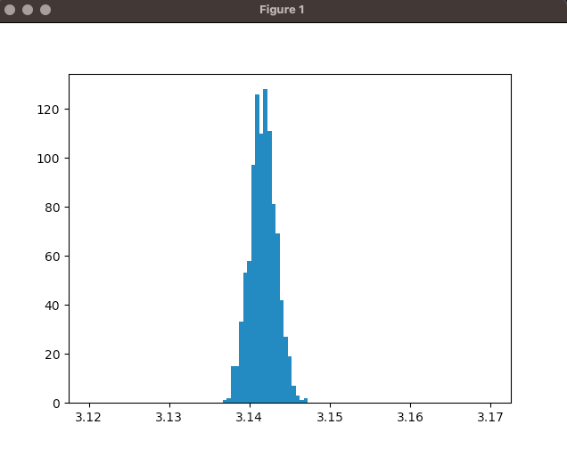

# Functionality

## Class functionality

- The overall class is an estimator for pi. With a size of 100 estimations we can observe a normal distribution around the correct pi (i.e. 3.14159...)
- With the variable M >> 100 we can observe a much more normal distributed looking graph.

## Each functions functionality

### Imports

- We are working with the libraries numpy (for several functions) and matplotlib (to create a histogram).

### Function uniform

- Generates a random number between 0 and 1.

### Function f

- Generates the squareroot of the absolute value of the random number from **uniform** and 1.

### Function NoName (renamed to pi_estimator)

- Generates 1000 comparisons between the result of **uniform** and the result of **f**
- When observing the results of the comparison we can observe, that mostly in around 75% to 80% of the cases result of **f** > **uniform**.
- Multiplying this decimal with 4 leads to a single estimation of pi.

### main

- Appends multiple estimations of pi into a list and plots a histogram that is ranged close to pi including the estimations of pi. With a small M the estimation does not look quite normal distributed but with a big M the estimation looks quite like a normal distribution around pi.
- An estimator with M==10000 looks like this:
  

# Runtime + Optimization

## Runtime (before optimization)

- Runtime before optimization with M=100: ~10 sec.

## Optimization

- Create the random values for x and y without a for-loop (line 29).
- Compare values of **uniform** and **f** without a for-loop (line 31).
- list_sigma is not used. It can be removed. So the standard deviation of each estimation does not have to be calculated.
- Also remove the static passed values.

## Runtime (after optimization)

- Runtime after optimization with M=100: ~0 sec.
