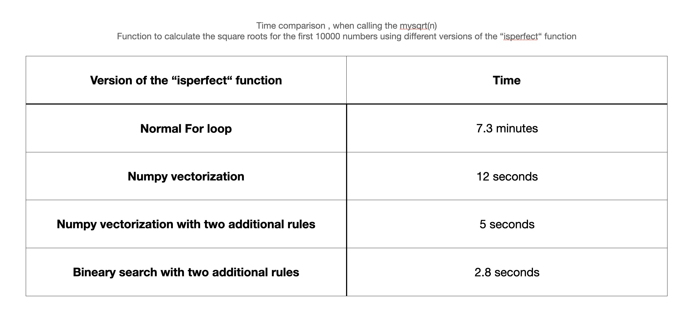

# The objective of the third homework
* Analyse the square root programm that was achieved in the second homework in terms of time complexity and modify the functions to achieve improve the ecexution time. 

# Steps: 
* examining different value ranges of n, such as 10, 100, and 1000, to determine which helper functions take more or less time. 
* The time complexity of each function is approximated by identifying the loops and their arguments, as well as how many times they take place (Big O Notation)
* optimal code for each helper function is suggested, such as using vectorization, and the new time complexity is identified

# Results: 
   To measure the performance of the helper functions, the mysqrt(n) function was called on a series of numbers between 1 and 10000.
   
   
   
   ### Findings: 
   
   * The program took approximately 7.3 minutes to complete its execution. 

   * It can be seen that the run time of the isperfect() function starts at zero and increases linearly up to 0.6 milliseconds, as the given number increases. This linear increase in run time is evident.
   
   * It is observed that the execution time of the getLowUpper(n) function also shows a linear increase as the given number increases. This is expected as this function depends on the isperfect(n) function, which we observed to have a linear increase in execution time.
   
   
  ### Improvments: 
To enhance the run time of the program, optimizing the isperfect(n) function should be prioritized as it has a significant impact on the overall execution time. Improvements in the isperfect(n) function will also result in better run time for other functions, such as getlowUpper(), which rely on it.
#### 1. The utilization of NumPy arrays provides the advantage of performing vectorized operations, which can    
  significantly improve the program's run time.
  The execution time of the isperfect() function on numbers ranging from 1 to 100000 was approximately 4.6 minutes.   However, when using the NumPy version of the function, the execution time reduced to just 0.08 minutes. 
  
  
  The plot of the execution times reveals that the increase in time is not linear as the input value increases. 
  Instead,there are significant fluctuations, and in most cases, the execution time was around 0.2 milliseconds.
  While running the sqrt program on the first 10000 numbers, it took approximately 7 minutes. However, after
  implementing the NumPy version of the isperfect(n) function, the execution time reduced to just 12 seconds, which 
  represents a significant improvement.
         
  The plots demonstrate the significant improvement in run time achieved with the NumPy version of the isperfect() function in comparison to the normal version. For most numbers, the execution time was less than 0.02 milliseconds, whereas with the normal version, the run time increased linearly as the input value increased. Furthermore, the optimization of the isperfect() function led to improvements in the execution time of the getLowUpper(n) function, as shown in the second plot. For most numbers, the getLowUpper(n) function now takes less than 3.0 milliseconds, whereas with the previous version of the isperfect() function, it took at least 12 milliseconds to compute.
       
       
#### 2. numpy with additional improvments: 
  
  to improve the performance of the numpy version of the isperfect() function furthermore , addtional imporvmnets were achieved: 
   * A perfect square always has a whole number as its square root, and the last digit of the square root can only be one of the digits (0, 1, 4, 5, 9). This can be easily verified by squaring any whole number and observing the last digit of the result. (link: https://www.quora.com/Do-perfect-square-numbers-end-only-in-0-1-4-5-6-and-9-If-so-why)
   * A perfect square root always has digital summation of one of these numbers (1,4,7,9) and if it does not , then it is not a perfect square root (link: https://math.stackexchange.com/questions/1377322/digital-roots-of-square-numbers)

   The modifications made to the numpy version of the isperfect method resulted in a processing time of approximately 5 seconds for computing the square root of the first 10000 numbers. 
   
     
   The plots also demonstrate that incorporating these changes into the numpy version of the isperfect method improved the execution time of the getLowUpper() method.
             
             
#### 3. Binary search with the two modification rules:

  In the final step of modifications, the two above mentioned rules were combined with binary search to further enhance the run time of the isperfect() method, as well as the overall program run time. As a result, it only took 2.82 seconds to calculate the square root of the first 10000 numbers, which is a significant improvement.
  
  
        
        
#### conclusion: 
  

# Time complexity: 
      
* The time complexity of the first version of the isperfect() function is O(n), as it has a for loop , where in the worst case all numbers should be iterated over. 
* The time complexity of the numpy version of the isperfect() function is also O(n), as
  np.arange(n) of the function creates a numpy array of size n, which takes O(n) time, but despit the fact that the numpy version has linear time complexity , it runs way faster than the first version of the function
* The time complexity of the binary search method with the two additioanl rules is O(log n)   
        
   
