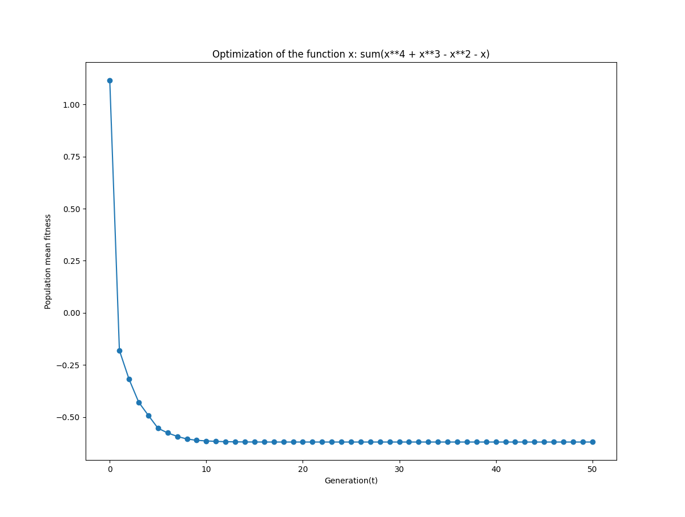
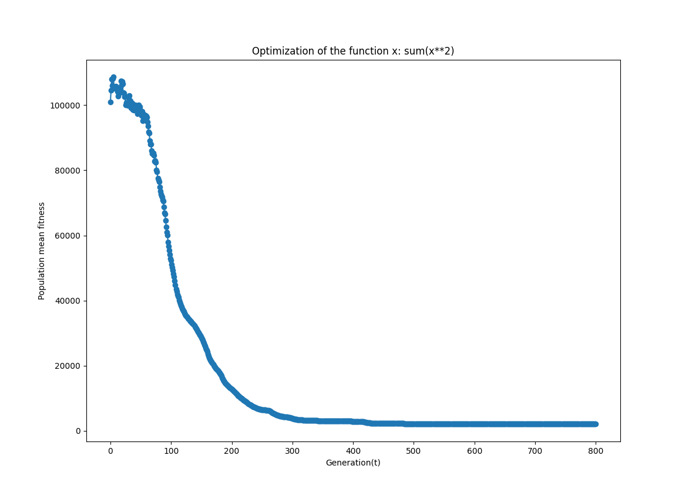
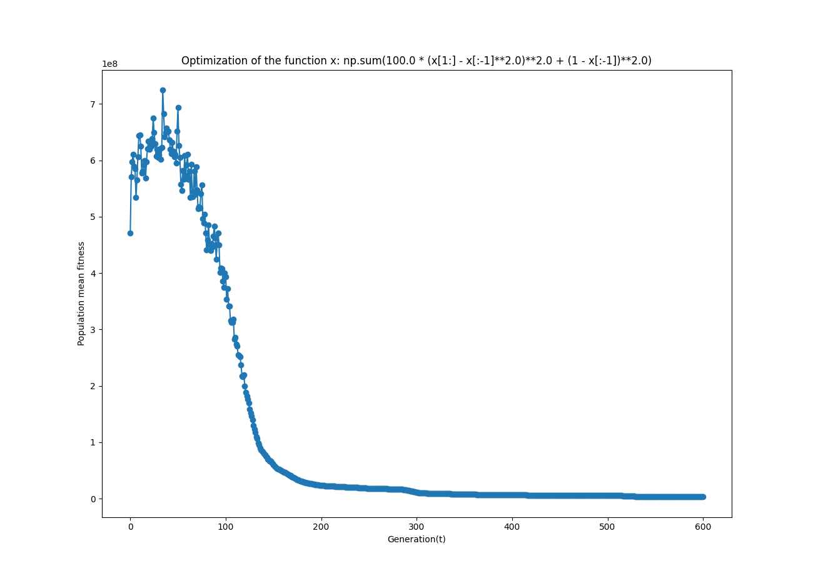

# Differential Evolutionary Algorithm
The script [schmidt_h7.py](schmidt_hw7.py) implements a version of the DEA to estimate values for an `n`-dimensional 
input-vector `x` that minimize a function `f`.

Alongside the DEA parameters, different functions can be provided as strings of lambda functions. For example:

```
python schmidt_hw7.py -f "lambda x: sum(x**4 + x**3 - x**2 - x)"
```


# Homework functions
## Function 1
First, we want to minimize the 1-dimensional function `x**4 + x**3 - x**2 - x` on the closed interval `[-2 , 2]`.
As the `evaluate` function expects an array as input, the lambda function also needs to be summed.
So we call the function as follows:
```
python schmidt_hw7.py -f "lambda x: sum(x**4 + x**3 - x**2 - x)" -n 1 -xL -2 -xU 2
```


## Function 2
Next, we want to minimize the `n=30`-dimensional function `sum(x^2)` on the closed interval `[-100 , 100]`.
```
python schmidt_hw7.py -f "lambda x: sum(x**2)" -n 30 -xL -100 -xU 100 -T 800
```


## Function 3 
Finally, we try to minimize the Generalized Rosenbrock function for `n = 30` (see page 87 in "Advances in Evolutionary Computing")
on the closed interval `[-30 , 30]`.
As the function always uses the jth and (j+1)th element of a vector, the lamda function works with two vectors:
- All elements from `j=1` until `n-1`: `x[:-1]`
- All elements from `j+1=2` until `n`: `x[1:]`

```
python schmidt_hw7.py -f "lambda x: np.sum(100.0 * (x[1:] - x[:-1]**2.0)**2.0 + (1 - x[:-1])**2.0)" -n 30 -xL -30 -xU 30 -T 600
```
