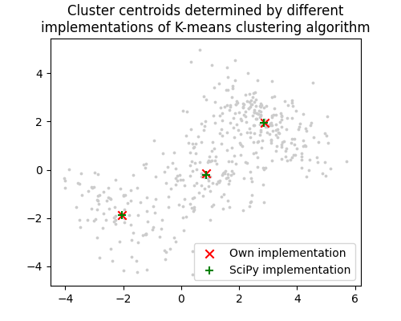

# Homework 6

## Implementation of K-means clustering algorithm

The script `k-means.py` implements the k-mean clustering algorithm using NumPy and performs clustering on a artificially
generated dataset. The result is compared with the implementation of [SciPy](https://docs.scipy.org/doc/scipy/reference/generated/scipy.cluster.vq.kmeans.html)
and visualized in this figure:

## Time complexity

At each iteration the k-means algorithm calculates to distance of every point the current centroids and find the closest centroid. After that the mean of points closest to a centroid is computed to determine the new centroid. This is repeated for every centroid. In conclusion, the time complexity is $\mathcal{O}(n \cdot k)$ where $n$ is the number of points and $k$ the number of clusters.

With a fixed number of iterations $N$ the overall time complexity is $\mathcal{O}(N \cdot n \cdot k)$.

However, the implementation only searches for a local minimum of the distortion, i. e., the mean distance of all points to their closest cluster centroid. It has been shown by Mahajan et al. that finding the global optimum is NP-hard [1].

## References

[1] M. Mahajan, P. Nimbhorkar, K. Varadarajan, The planar k-means problem is NP-hard. In: *Theoretical Computer Science*, Vol. 442, 2012, pp. 13 - 21.
