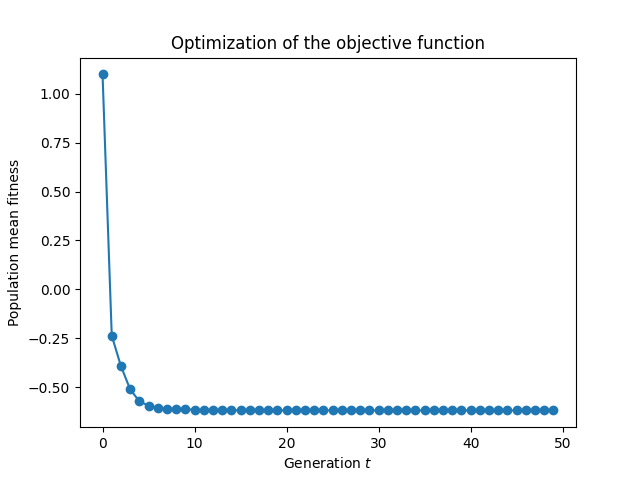
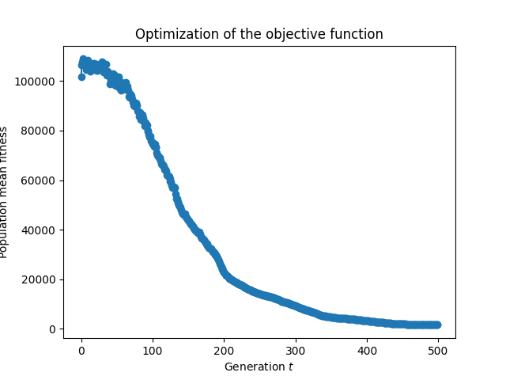
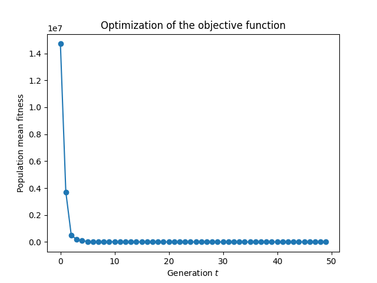

# Homework 7

In this exercise an evolutionary algorithm is implemented and used to minimize three different functions. The program
can be parameterized from the command line by specifying the objective function, solution space and other parameters
of the optimization algorithm.

## Problem 1

**Inputs:**

- Objective function: $f(x) = x^4 + x^3 − x^2 − x$
- Dimension of solution space: $n = 1$
- Bounds of solution space: $x_L = -2$ and $x_U = 2$

**Command:**

``` bash
python3 dea.py --seed 123 -f 'x**4 + x**3 - x**2 - x' -n 1 -xL -2 -xU 2
```

**Result:**



``` text
Best solution:
    x  = [0.64038895]
  f(x) = [-0.61968435]
```


## Problem 2

**Inputs:**

- Objective function: $f(x) = \sum_{i=1}^n x_i^2$
- Dimension of solution space: $n = 30$
- Bounds of solution space: $x_L = -100$ and $x_U = 100$

**Command:**

``` bash
python3 dea.py --seed 123 -f 'sum(x**2)' -n 30 -T 500 -xL -100 -xU 100
```

**Results:**



``` text
Best solution:
    x  = [-4.2566508   2.00025618 -0.32272347 -1.39588939  0.75208934 -2.23050001
          -1.4130107  -1.2075723  -1.85458225  0.3736694   0.81051733  4.63365878
           2.9877821   0.54333365  2.15797901  0.23487703 -0.99330071 -1.08910475
          37.17865712  0.91741305 -0.82018719 -0.40350954 -0.83100436  1.77906068
           3.37953993 -0.16760953  3.34576784  3.77124683 -2.1464933  -6.30450221]
  f(x) = 1543.9874563430822
```

**Observations:**

Because of the high-dimensional solution space, the algorithms requires more generations to converge to a mean fitnessclose to 0.

## Problem 3

**Inputs:**

- Objective function: [Rosenbrock function](https://en.wikipedia.org/wiki/Rosenbrock_function), i. e., $f(x) = \sum_{i=1}^{n-1} (100(x_{i+1} - x_i^2)^2 - (x_i - 1)^2)$
- Dimension of solution space: $n = 2$
- Bounds of solution space: $x_L = -30$ and $x_U = 30$

**Command:**

``` bash
python3 dea.py --seed 123 -n 2 -xL -30 -xU 30 -f 'sum(100 * (x[i+1] - x[i]**2)**2 - (x[i] - 1)**2 for i in range(len(x) - 1))'
```

**Result:**



``` text
Best solution:
    x  = [-6.29276935 39.57442085]
  f(x) = -53.124336127778804
```
